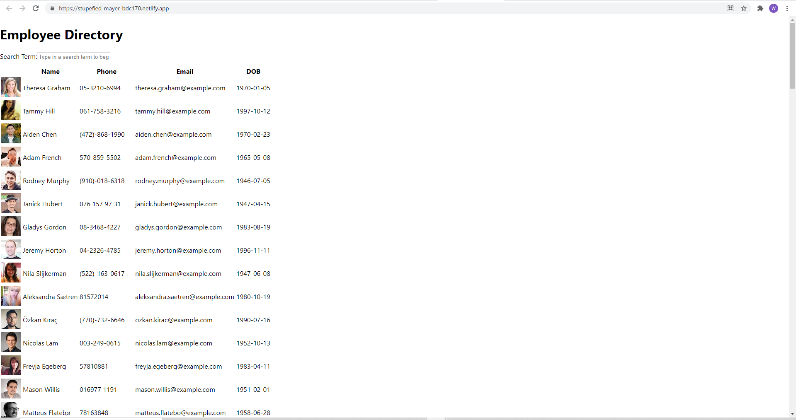

# React Employee Directory

This app will allow users to search through a pool of random employees from the RANDOM USER API. They can then search for employees by name, phone, or email. Employees are then sorted by last name alphabetically. In the future we will upgrade to add more search parameters and more advanced sort features.

## Deployed App Homepage/offline

## License
  ​
This project is licensed under the Unlicensed license.
  
## Questions
  ​
If you have any questions about the repo, open an issue or contact me directly at BigRonald42@hotmail.com. You can find more of my work at [GitHub](https://github.com/BiggRonn/).

## Link to Deployed App
https://stupefied-mayer-bdc170.netlify.app/

## Resources used 
https://react-bootstrap.github.io/components/table/